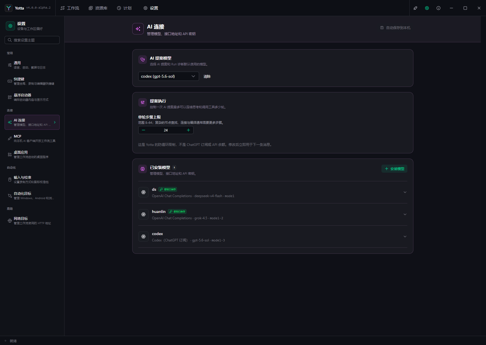

# Settings

Settings save automatically on this device. Machine paths, target identities, endpoints, and
credentials do not become portable workflow content.

| Category | Configure |
| --- | --- |
| General | language, startup/close behavior, capture backend, logs |
| Shortcuts | system, recording, workflow, schedule, and editor keys |
| Input & Calibration | relative/absolute recording and counts-per-360 profiles |
| Floating Launcher | entries, display, size, and temporary `1–9` shortcuts |
| AI Connections | model slots, protocol, endpoint, credentials, capabilities |
| MCP | local server, port, and client URL |
| Desktop Applications | executable paths and arguments |
| Automation Targets | Windows, Android, and browser identities |
| Network Targets | HTTP base URL, timeout, and response limit |

Language UI changes immediately; some templates require restart. Capture backend changes require
restart. Recording mode applies to the next recording.

Slots are stable workflow references and cannot be renamed after saving. Remote AI endpoints require
HTTPS; local HTTP requires explicit risk acknowledgement. Saved API keys are not displayed again.

The launcher shortcut switch controls temporary slot shortcuts, not a global key for opening the
launcher.

If settings were saved but runtime synchronization failed, do not save repeatedly; restart Yotta to
reload runtime state.
