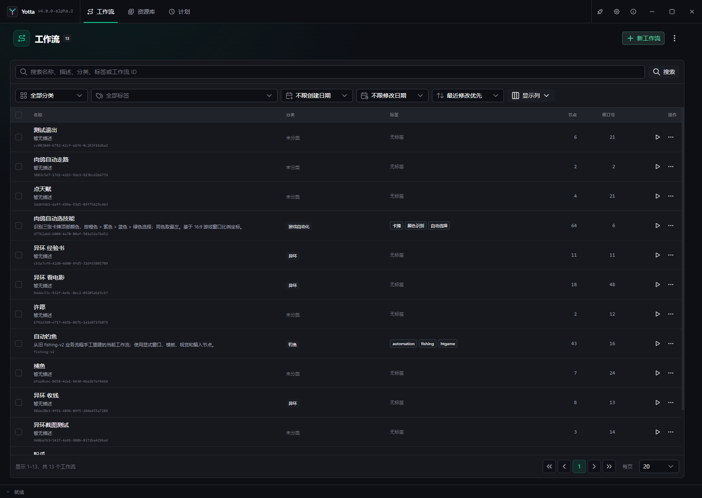

# 快速开始：完成第一次桌面点击

这篇教程会完成一条真实的 Windows 自动化路径：

```text
添加桌面应用 → 创建窗口自动化目标 → 新建工作流
→ 设置工作流默认目标 → 添加点击指针 → 保存、检查、运行
```

完成后，你会得到一个能在指定窗口客户区位置单击左键的工作流。

> 第一次练习请选择可以安全点击的程序和空白位置，例如你自己创建的测试窗口。不要直接对包含删除、支付、
> 发送或覆盖操作的界面测试。

## 准备工作

- Windows 11 x64；
- 已解压并启动 Yotta；
- 一个正在运行、允许你测试点击的桌面程序；
- 知道该程序的可执行文件位置。

## 第一步：添加桌面应用

1. 点击顶部“设置”。
2. 在左侧选择“桌面应用”。
3. 点击“添加应用”。
4. 填写容易识别的显示名称，例如“测试记事本”。
5. 选择该程序的可执行文件。
6. 如果程序需要启动参数，每行填写一个参数；本教程可以留空。

Yotta 会为应用创建稳定配置槽位。工作流通过槽位引用应用，而不是把你电脑上的绝对路径写进工作流。

设置会自动保存。等右上角显示“已保存到本机”后再继续。

## 第二步：创建 Windows 自动化目标

1. 在设置左侧选择“自动化目标”。
2. 点击“添加窗口目标”并选择“Windows 目标”。
3. 填写显示名称，例如“测试窗口”。
4. 在“应用配置”中选择刚才添加的桌面应用。
5. 设置窗口标题匹配：标题固定时选择“精确匹配”；标题会变化时选择“正则匹配”。
6. 多个窗口可能同时匹配时，第一次练习建议选择“必须唯一，否则报错”。
7. 输入后端选择 `SendInput · 前台系统输入`。
8. 截图后端保持默认即可；点击指针本身不依赖截图内容。
9. 点击“检查当前窗口匹配”，确认只找到你准备的测试窗口。

也可以使用“捕获并启用窗口”：开始捕获后切换到目标窗口，按 F9 或当前配置的捕获快捷键。Yotta 会读取
窗口标题、窗口类和程序路径；确认结果后再保存。

目标槽位保存后不能改名，因为工作流会引用它。显示名称可以用于日常识别。

## 第三步：新建工作流

1. 点击顶部“工作流”。
2. 点击右上角“新工作流”。
3. 输入名称，例如“第一次点击”。
4. 打开刚创建的工作流。



新工作流会包含一个“Run 开始”节点。它在每次 Run 开始时发出一次信号，是本教程的执行入口。

## 第四步：设置工作流默认自动化目标

进入编辑器后，在画布顶部工具区找到显示器图标“默认自动化目标”。

1. 点击显示器图标。
2. 从下拉列表选择第二步创建的“测试窗口”。
3. 关闭弹出框。

工作流默认目标会被需要 `target` 的自动化节点继承。这样同一工作流里的多个点击、移动或按键节点不必重复
选择目标。单个节点仍可以在右侧检查器中显式选择另一个槽位覆盖默认值。

默认目标保存的是逻辑槽位，不是当前窗口句柄。分享工作流后，接收者可以把同一逻辑需求绑定到自己的目标。

## 第五步：添加“点击指针”节点

1. 点击画布左上方“添加节点”。
2. 搜索“点击指针”。
3. 单击结果，或拖到画布中。
4. 选中“点击指针”节点，在右侧检查器查看配置。

| 输入 | 本教程设置 | 含义 |
| --- | --- | --- |
| 目标 | 继承工作流默认目标 | 决定点击哪个窗口 |
| 点 | 例如 `X=0.5, Y=0.5, 比例` | 点击窗口客户区中心 |
| 指针按键 | 左键 | 使用左键、右键或中键 |
| 按住时长 | 保持默认 | 按下到释放之间的时间 |

比例坐标 `0.5, 0.5` 表示目标窗口客户区中心，不是屏幕中心。第一次测试应选择不会触发危险操作的位置。

## 第六步：连接执行顺序

节点左右两侧的三角端口是信号端口。

1. 从“Run 开始”的“已开始”输出按住鼠标拖线。
2. 拖到“点击指针”的“输入”端口后松开。

```text
Run 开始：已开始 ──> 点击指针：输入
```

“点击指针”的“完成”可以暂时不连接，表示点击成功后路径正常结束。“失败”也可以暂时不连接；点击失败时，
Run 会停止并在时间线显示节点和错误码。正式工作流建议连接错误处理路径。

## 第七步：保存并检查

1. 点击右上角“保存”。
2. 打开“工具”，执行“检查”。
3. 确认没有阻断错误。

如果检查器显示目标为空，确认工作流默认目标已经设置；如果节点显式选择了其他目标，点击“恢复继承”让它
重新使用工作流默认值。

## 第八步：运行

1. 保持测试程序正在运行。
2. 点击右上角“运行”。
3. Yotta 会解析目标窗口，并在客户区中心执行一次左键点击。
4. 打开底部“时间线”，确认“Run 开始”和“点击指针”依次成功。

运行中再次点击运行入口会停止对应 Run。紧急情况下使用全局强停快捷键。

## 第九步：故意观察一次失败

关闭测试程序后再次运行工作流。Yotta 应报告目标不可用，并在 Run 或启动结果中指出原因。重新打开目标程序
后再运行，确认流程恢复。

可靠自动化不仅要知道成功时发生什么，也要知道目标缺失时如何失败。

## 你已经掌握了什么

- 桌面应用保存程序路径；
- 自动化目标负责找到具体窗口并选择输入方式；
- 工作流默认目标让多个节点继承同一个逻辑槽位；
- “Run 开始”决定执行入口；
- “点击指针”在目标客户区坐标执行点击；
- 信号线决定节点执行顺序；
- 保存、检查和时间线分别负责持久化、验证和运行证据。

下一步阅读[工作流编辑器完整导览](../workflow-editor/interface-tour.md)和[节点使用场景](../nodes/scenarios.md)。

## 下载、在线市场与 AI

软件包可从 [GitHub Release](https://github.com/yuelioi/yotta/releases) 下载并解压。
在线市场可以浏览和安装他人发布的工作流；安装后检查作品需要的自动化目标及依赖，并配置本机窗口或设备。
网页市场位于 [yotta.yuelili.com](https://yotta.yuelili.com)，投稿从软件内的发布入口进行。

需要 AI 辅助时，在设置中配置并验证支持相应能力的模型，保存工作流后打开 [AI 提案](../ai-proposals.md)。
