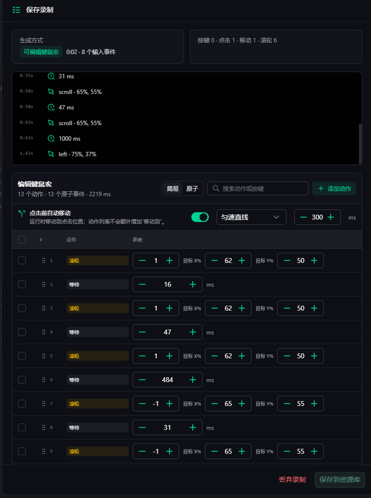
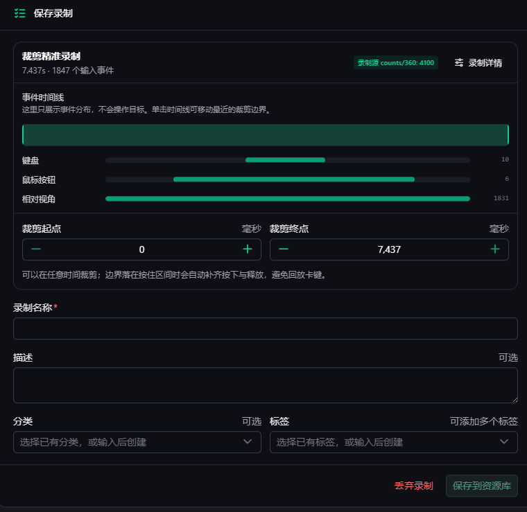

# 资源与录制

资源库保存可复用的输入录制。工作流引用的是资源的稳定内容，不会因为你整理资源名称或分类而改变已保存的
执行内容。

## 键鼠宏

键鼠宏把录制结果转换为可编辑动作。你可以调整按键、点击位置、滚轮、等待和点击前自动移动。适合菜单操作、
固定位置点击和短按键序列。

宏中的位置通常按录制基准分辨率保存。目标分辨率不同或窗口区域变化时，应检查缩放后的点击位置。

## 精准录制

精准录制保留原始事件时序、连续移动、拖拽和相对鼠标位移，适合视角转动或需要轨迹细节的操作。保存前可以
调整裁剪起点和终点；边界落在按住区间时，Yotta 会补齐按下/释放事件，避免回放后出现卡键。

相对鼠标录制需要有效的 360° 校准档。不同游戏或不同游戏内灵敏度应分别建立校准档。

## 选择哪一种

| 需求 | 推荐资源 |
| --- | --- |
| 需要逐条修改按键和点击 | 键鼠宏 |
| 需要拖拽、连续轨迹或视角转动 | 精准录制 |

资源录制失败时，先确认目标窗口仍在运行、输入后端可用，并检查录制快捷键是否冲突。
