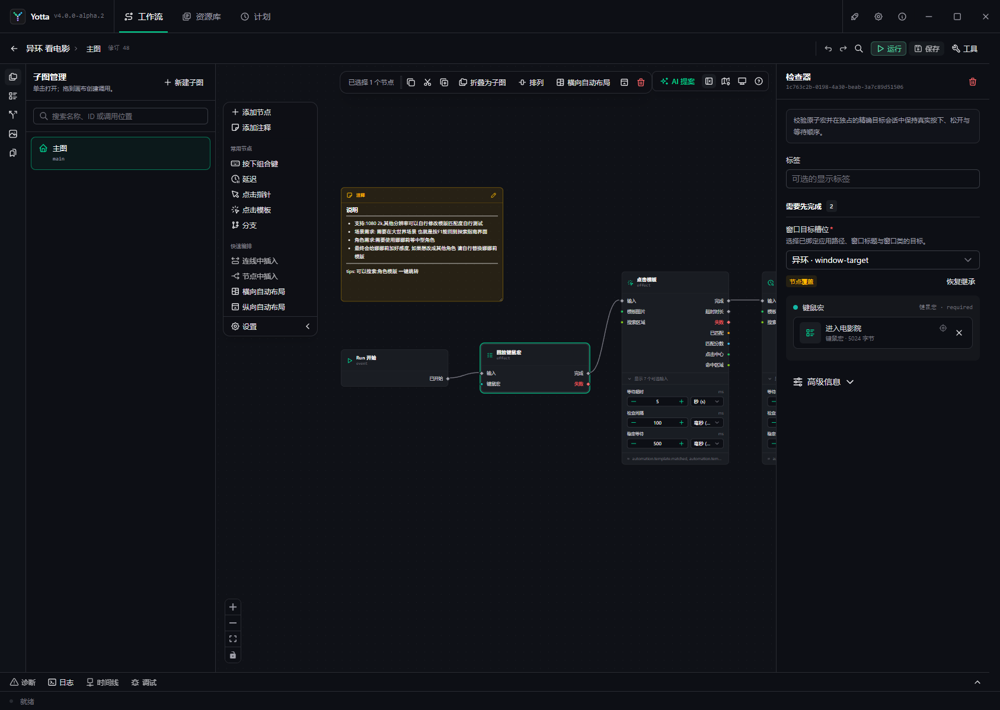

# 工作流编辑器完整导览



编辑器同时承担创作、配置、检查、运行和调试，因此第一次打开会显得复杂。可以把界面从上到下、从左到右
分成七个区域：

```text
顶部工作流栏
├─ 左侧工作区栏 ─ 子图/状态/资源/片段
├─ 左侧管理面板 ─ 当前工具的列表与操作
├─ 中央视觉画布 ─ 节点、调用、注释和连线
├─ 画布辅助工具 ─ 添加、插入、布局和默认目标
├─ 右侧检查器   ─ 当前节点或子图的详细配置
└─ 底部运行工作台 ─ 诊断、日志、时间线和调试
```

## 1. 顶部工作流栏

顶部栏负责当前工作流级操作，而不是单个节点配置。

### 返回、名称与修订号

左侧返回按钮回到工作流列表。其后显示工作流名称、当前图路径和修订号。

- “未保存”表示内存草稿与已持久化版本不同。
- 修订号在每次成功保存后递增。
- 如果另一个操作已经更新同一工作流，当前保存会报告修订冲突，不会静默覆盖。

### 撤销与重做

撤销/重做只作用于当前编辑会话。保存不会清空所有创作历史，但重新加载会以持久版本重新建立会话。

### 定位节点

搜索图标可以按节点名称、节点 ID、类型或所在图定位当前工作流中的节点。复杂工作流不要只依赖缩放画布寻找。

### 运行、保存与工具

- **运行**：保存并检查需要的内容后创建普通 Run；已有活动 Run 时显示停止操作。
- **保存**：把当前草稿提交为新修订。
- **工具**：集中放置检查、调试、状态、时间线、编辑器设置和重新加载等低频操作。

保存失败时草稿仍保留。优先使用错误旁的“定位问题”，不要先退出编辑器。

## 2. 左侧工作区栏

画布最左侧的竖向图标切换不同创作工具。选中的工具会在旁边打开管理面板。

### 子图管理

显示主图、子图和调用关系。你可以：

- 新建子图；
- 搜索名称、ID 或调用位置；
- 打开子图；
- 定位调用者；
- 复制、删除或管理子图接口。

面包屑显示当前所在图。主图是 Run 入口；子图只有被调用时才执行。

### 节点目录

按分类浏览或搜索当前 Catalog 中可用的节点。单击会添加到建议位置，也可以拖到画布指定位置。

节点搜索匹配用户名称、类型和标签。知道目标时直接搜索，例如“点击指针”“延迟”或“HTTP GET”，通常比
逐层展开分类更快。

### Run 状态

管理当前工作流声明的强类型状态变量。状态变量需要名称、类型和默认值；每个 Run 都会得到独立实例。

修改已经被节点引用的状态类型前，先查看引用位置。类型不兼容会使相关节点或连线无法保存。

### 工作流资源

管理随工作流携带的输入录制资源，并可以定位使用它们的节点。资源属于工作流时会随工作流包导出。

### Snippet

Snippet 是一个可重复插入的节点模板，保存节点配置和输入绑定。它不是多节点工作流；多节点复用应使用子图。

## 3. 左侧管理面板

管理面板内容取决于工作区栏选择。例如子图管理显示图列表，资源面板显示工作流资源。

- 面板顶部通常提供搜索和新建操作。
- 列表项单击打开或选中。
- 与删除、复制、重命名相关的动作位于项目菜单或明显按钮中。
- 面板可以收起，为画布留出更多空间。

管理面板和右侧检查器职责不同：前者选择“管理哪个对象”，后者编辑“当前对象的属性”。

## 4. 中央视觉画布

画布保存四类可见对象：节点、子图调用、注释和连线。

### 平移与缩放

- 按住 Space 后拖动，或使用鼠标中键平移。
- 使用滚轮或左下角控件缩放。
- “适应画布”把当前图内容重新放入可见区域。
- 小地图适合在大图中快速确认当前位置。

打开画布帮助按钮可以查看当前键盘操作，不必记住所有组合。

### 选择

- 单击选择一个节点或连线。
- 在空白处框选多个对象。
- Shift 添加选择。
- Ctrl 切换单个对象是否在选择中。
- Esc 清除当前选择。
- Delete 删除已选择对象。

多选后，画布顶部会出现选择工具条，可复制、剪切、删除、折叠为子图或执行布局。

### 节点

节点标题说明操作，端口说明输入、输出和执行路径。节点颜色和图标帮助识别类别，但类型兼容以端口契约为准，
不能只根据颜色猜测。

节点上的运行状态、警告或错误标记来自最近一次检查或当前 Run。点击节点后，详细配置出现在右侧检查器。

### 注释

注释用于记录流程目的、前置条件和维护信息。支持 Markdown 预览，并可以拖动和调整尺寸。注释不参与执行。

## 5. 连线和端口

### 信号端口

三角形端口决定执行顺序。常见信号包括输入、完成、失败、真、假、循环体、中断和耗尽。

从输出端口拖到输入端口建立连线。一个未连接的普通完成出口表示该路径在这里正常结束；未连接的错误出口
会让 Run 失败。

### 数据端口

圆形或类型化数据端口传递值。数据线不会单独启动节点；节点收到执行信号时读取已经绑定的数据。

输入可以来自：

- 检查器中填写的固定值；
- 上游节点输出；
- Run 状态变量；
- 工作流资源；
- 编辑器提供的专用选择器。

拖线过程中编辑器只允许兼容目标。如果需要转换，添加明确的转换节点，这样时间线能看到数据如何变化。

### 重排连线

选择信号连线后可以添加重排点，让长连线绕开节点。重排点只改变画布路径，不改变执行语义。

## 6. 画布辅助工具

画布上方或左上方的辅助工具提供高频创作操作。

### 添加节点与快速添加

“添加节点”打开完整节点目录。快速添加更适合已经知道名称的节点，也可以在选中信号连线时插入兼容节点。

### 自动布局

- 横向自动布局：主要执行方向从左到右。
- 纵向自动布局：主要执行方向从上到下。
- 排列：整理当前选择。

自动布局会改变节点位置，不改变配置和执行关系。复杂手工布局前可以先保存，方便撤销比较。

### 默认自动化目标

显示器图标打开工作流默认目标选择器。选择后，需要通用 `target` 的自动化节点会自动继承该槽位。

- 节点没有显式目标：使用工作流默认目标。
- 节点显式选择目标：覆盖默认目标。
- 点击“恢复继承”：删除节点覆盖，重新跟随默认值。
- 清除工作流默认目标：没有显式目标的节点会在检查时要求配置。

默认目标适合“整个工作流主要操作一个窗口”的情况。跨 Windows、Android 或浏览器的工作流应让不同节点
显式选择各自目标，或使用清楚的目标默认设计。

## 7. 右侧检查器

检查器始终对应当前选择。

### 没有选择节点

显示选择提示；位于子图时可能显示子图接口管理，用于添加、重命名、排序或删除输入输出。

### 选择普通节点

从上到下通常包含：

1. 节点名称和删除按钮；
2. 节点用途说明；
3. 自定义显示标签；
4. 必填输入；
5. 常用输入；
6. 高级配置；
7. 输出与运行能力信息。

带星号的字段必须填写或连接。字段显示“继承”时，值来自工作流默认目标等上层配置。

### 固定值与连接值

输入已连接数据线时，检查器不会再把固定值当作有效运行输入。要恢复固定值，先删除对应数据线；要使用上游
值，则保留连线并避免维护无效的重复配置。

### 高级信息

高级区域可能显示节点 capability、配置目标、状态事件和低频参数。普通用户不需要逐项修改；排查“为什么
这个节点需要目标或凭据”时再展开。

## 8. 工作流设置

顶部“工作流设置”用于修改工作流名称、描述、分类和标签。它与画布节点配置分开，但仍和 Source 使用同一
修订提交。

如果画布存在无效节点或字段，工作流信息也可能暂时无法保存；先根据诊断定位并修正内容。

## 9. 底部运行工作台

底部栏包含四个区域。

### 诊断

展示当前草稿的编译问题。错误会阻止运行，警告和提示用于说明潜在问题。点击诊断可以跳转到对应图、节点和
字段。

### 日志

显示工作流和系统日志。适合查看过程信息和内部关联字段，但不能替代时间线中的正式执行结果。

### 时间线

展示当前 Run 的节点尝试、外部动作、状态、错误码和发生时间。点击条目可以定位节点。详细说明见
[Run 与调试](../runs/index.md)。

### 调试

显示断点、暂停位置、当前输入、状态和已产生的值，并提供继续、暂停和单步控制。调试仍会操作真实目标。

运行工作台可以展开、收起或放大。画布空间不足时先收起；排查问题时再展开并定位第一个失败节点。

## 10. 推荐的新手操作顺序

每次增加一小段流程后按下面顺序工作：

1. 添加并配置节点；
2. 连接信号和数据端口；
3. 保存；
4. 检查诊断；
5. 对安全目标运行；
6. 从时间线确认实际路径；
7. 再继续增加下一段。

不要先堆出几十个节点再第一次运行。小步保存和检查能把错误限制在最近的修改中。
